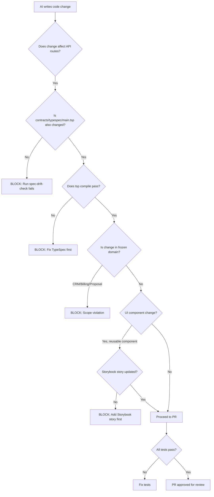

# AI Agent Boundaries

This document defines where AI coding agents (including Claude Code) are allowed and forbidden to make changes. It also provides prompt templates for common tasks.

## Why This Exists

AI agents generate plausible-looking code that can:
1. Silently drift the API away from the TypeSpec contract
2. Implement CRM/billing/sales features that are out of MVP scope
3. Create UI components without Storybook stories
4. Write implementation before the spec exists
5. Add individual student login or payment logic that is explicitly frozen

This document is a pre-flight checklist and boundary map.

---

## Component Ownership Map

| Domain | Owner Layer | Primary Package |
|---|---|---|
| API contracts | TypeSpec | `contracts/typespec/` |
| Shared types | Generated | `generated/openapi/` |
| Curriculum logic | packages | `packages/curriculum-engine/` |
| Simulation schema | packages | `packages/simulation-schema/` |
| Evaluation logic | packages | `packages/evaluation-engine/` |
| Shared utilities | packages | `packages/shared/` |
| Web admin UI | apps | `apps/web/` |
| API server | apps | `apps/api/` |
| Quest app | apps | `apps/quest/` (Unity) |

---

## Allowed Edit Zones

AI agents may freely edit these areas:

| Zone | Condition |
|---|---|
| `packages/curriculum-engine/` | Only if `CurriculumMap` or `LearningConcept` TypeSpec models are not changed |
| `packages/evaluation-engine/` | Only if `EvaluationRecord` TypeSpec model is not changed |
| `packages/simulation-schema/` | Only if `SimulationModule` TypeSpec model is not changed |
| `packages/shared/utils/` | Pure utility functions, no domain models |
| `apps/web/components/` | Only if a Storybook story is created/updated in the same PR |
| `apps/api/routes/` | Only if `contracts/typespec/main.tsp` is updated in the same PR |
| `apps/api/services/` | Only for services corresponding to existing TypeSpec-defined routes |
| `docs/` | Freely, for spec and design documentation |
| `scripts/` | Freely, for tooling |
| `.github/workflows/` | With caution; CI changes must not disable drift checks |
| `vitest.config.ts`, `tsconfig.json`, `package.json` | With caution; dependency additions need review |

---

## Forbidden Edit Zones

AI agents must NOT make changes in these areas without explicit human instruction:

| Zone | Reason |
|---|---|
| `generated/openapi/openapi.json` | Generated by `npm run contract:compile`; never edit manually |
| `contracts/typespec/main.tsp` (routes) | New routes require product decision; not AI-initiated |
| `apps/api/db/migrations/` | Schema migrations require explicit human review |
| Any file implementing `CRMLead`, `Proposal`, `BillingPlan` routes | These are frozen shell domains |
| Any file implementing individual student login | Not in MVP scope |
| Any file implementing payment gateway | Not in MVP scope |
| Any file introducing a new `UserRole` | Role model is frozen in MVP |
| `.env` files | Never touch secrets |
| Any file that bypasses `spec-drift-check.mjs` | The drift check must not be disabled |

---

## TypeSpec-First Rule

> **No API route may be implemented before it exists in `contracts/typespec/main.tsp`.**

Sequence for adding a new endpoint:
1. Define model and operation in `main.tsp`
2. Run `npm run contract:compile` — verify it compiles
3. Verify `generated/openapi/openapi.json` is updated
4. Implement the route in `apps/api/routes/`
5. Write a test for the route

If step 1 is skipped, the drift check will block the PR.

---

## API Drift Rule

If any file under `apps/api/` changes and `contracts/typespec/main.tsp` does not change in the same commit, the drift check script will fail.

**Exception:** Changes to `apps/api/` that are purely:
- Error handling improvements
- Logging additions
- Performance changes that do not change request/response shapes

These exceptions must be documented in the PR description with the line: `[no-contract-change: <reason>]`

---

## Storybook-First UI Component Rule

> **No reusable UI component may be shipped without a Storybook story.**

A component is "reusable" if it is in:
- `apps/web/components/`
- `packages/shared/ui/`

A Storybook story must include:
- `Default` story
- `EmptyState` story
- `LoadingState` story
- `ErrorState` story
- `Mobile` story (if component is visible on mobile)
- Interaction test (if component has user interaction)

Accessibility notes must be documented in the story metadata.

---

## Prompt Templates

### Adding a New Simulation Module

```
Context:
- This is for the XR School Lab Platform (Indian K-12, North East India first)
- Platform is spec-driven: TypeSpec contract is source of truth
- No individual student login; evaluation is batch-level

Task: Add a new simulation module for [TOPIC]

Required output:
1. A new LearningConcept record for [CONCEPT] (JSON or TypeSpec example)
2. A CurriculumMap entry for [BOARD] / [GRADE BAND] / [SUBJECT] / [TOPIC]
3. SimulationModule definition with ALL required fields:
   - xrFitJustification (min 2 sentences explaining why VR > textbook/video for this topic)
   - instructorScript (4 sections: setup, during, debrief, revision trigger)
   - At least 3 CueCards
   - At least 1 pre-check and 1 post-check AssessmentHook
   - At least 1 RevisionCard
   - misconceptionsAddressed[] (min 1)
   - comfortRiskLevel with safetyNotes if medium or high

Do NOT:
- Create individual student accounts
- Add CRM, billing, or sales logic
- Add new UserRoles
- Edit generated/openapi/openapi.json directly
- Implement before TypeSpec is updated
```

---

### Adding a New Subject to Curriculum Map

```
Context:
- Platform covers CBSE, ICSE, State Board (North East India)
- New subject to add: [SUBJECT]
- Grade bands in scope: [GRADE BANDS]

Task: Extend curriculum ontology for [SUBJECT]

Required output:
1. List of LearningConcept records for [SUBJECT] (minimum 10 core concepts)
2. CurriculumMap entries for top 5 XR-fit topics in [SUBJECT]
3. XR fit classification for each topic with justification
4. Misconception list for each concept (2-3 per concept)
5. Bloom level mapping for each topic

Format: Follow the schema defined in docs/ontology/curriculum-ontology.md

Do NOT: Add Subject enum values to TypeSpec without a separate PR that includes:
- TypeSpec change in contracts/typespec/main.tsp
- Corresponding API test
- Updated docs/ontology/curriculum-ontology.md
```

---

### Adding a New Board / State Board Mapping

```
Context:
- Currently supported: CBSE, ICSE, State Board (generic)
- New board/state to add: [BOARD / STATE]

Task: Map [BOARD/STATE] curriculum for [SUBJECT] [GRADE BAND]

Required output:
1. CurriculumMap records for [BOARD/STATE] with:
   - board: stateBoard (or new enum value if different board)
   - stateBoardState: [STATE]
   - All required fields per docs/ontology/curriculum-ontology.md
2. localContextRelevance notes for North East India context where applicable
3. Comparison with CBSE equivalent topics (which are the same? which differ?)

If new enum value is needed in SchoolBoard or NorthEastState:
- Update contracts/typespec/main.tsp FIRST
- Run npm run contract:compile
- Then create the CurriculumMap records
```

---

### Adding a New API Endpoint

```
Context:
- All API routes must exist in contracts/typespec/main.tsp before implementation
- API is Fastify + TypeScript; PostgreSQL via Prisma

Task: Add endpoint for [OPERATION] on [RESOURCE]

Required output:
1. TypeSpec model addition / modification in contracts/typespec/main.tsp
2. Run npm run contract:compile — paste output confirming it compiles
3. Fastify route implementation in apps/api/routes/[resource].ts
4. Vitest test for the new endpoint
5. Updated Prisma schema if new model or field

Do NOT:
- Edit generated/openapi/openapi.json manually
- Create a route for CRMLead, Proposal, or BillingPlan (frozen shell)
- Add authentication/JWT logic without a security design decision
```

---

### Adding a Quest Simulation (Unity)

```
Context:
- Quest app: Unity, OpenXR, offline-first
- Simulation modules are defined in TypeSpec before Unity implementation
- Content is bundled as Unity Addressables

Task: Implement Unity simulation for [MODULE SLUG]

Required output:
1. Confirm SimulationModule record exists in catalog for [MODULE SLUG]
2. Unity scene following simulation design system (docs/simulation-design/simulation-design-system.md)
3. Cue card display component
4. Instructor mode overlay
5. Local session log writer (writes to /data/session-logs/)
6. Assessment hook trigger points
7. Comfort risk implementation (session timer for high-risk modules)
8. Local manifest update

Do NOT:
- Make network calls during simulation runtime
- Implement multiplayer networking
- Add individual student identification
- Exceed package size target for the grade band
```

---

### Generating a Storybook Story

```
Context:
- All reusable UI components require Storybook stories
- Component is in apps/web/components/ or packages/shared/ui/

Task: Generate Storybook stories for [COMPONENT NAME]

Required stories:
1. Default — happy path with realistic mock data
2. EmptyState — component with no data
3. LoadingState — component in loading/skeleton state
4. ErrorState — component showing error condition
5. Mobile — narrow viewport (375px) if applicable

Requirements:
- Mock data must be isolated; do not import production data
- MockData should be typed against TypeSpec-generated types
- Include accessibility notes in story metadata
- Add interaction test if component has buttons, forms, or user input
- Do NOT use real API calls in stories; use msw handlers or static mocks
```

---

### Adding an Evaluation Metric

```
Context:
- Evaluation is batch-level; no individual student accounts
- EvaluationRecord model is defined in contracts/typespec/main.tsp
- Changes to evaluation fields require TypeSpec update first

Task: Add evaluation metric [METRIC NAME]

Required output:
1. TypeSpec model change: add field to EvaluationRecord and CreateEvaluationRecordRequest
2. Run npm run contract:compile
3. Prisma schema migration for new field
4. Update apps/api/routes/evaluation-records.ts
5. Update evaluation form in web admin
6. Update packages/evaluation-engine/ scoring logic if applicable
7. Vitest test for scoring calculation

Do NOT:
- Add individual student identifiers to EvaluationRecord
- Add fields that assume internet connectivity during session
- Add fields that duplicate what BatchSession already captures
```

---

## AI-Safe Commit Workflow


