# Entity Relationship Diagram

This document shows the full data model relationships for the XR School Lab Platform MVP.

## Core ER Diagram

```mermaid
erDiagram
    School {
        string id PK
        string name
        enum board
        string stateBoardState
        enum region
        enum northEastState
        object address
        enum[] gradeBands
        int estimatedStudents
        string notes
    }

    LabDeployment {
        string id PK
        string schoolId FK
        string labName
        int roomSizeSqFt
        int headsetCount
        int classSize
        int batchSize
        int batchesPerClass
        bool projectorAvailable
        bool instructorProvidedByUs
        bool offlineFirst
        int targetQuestStorageGb
    }

    HardwareKit {
        string id PK
        string labDeploymentId FK
        int expectedSetupCostMinInr
        int expectedSetupCostMaxInr
        int monthlyStudentPriceInr
    }

    Instructor {
        string id PK
        string name
        string phone
        string email
        enum region
        enum[] assignedStates
        bool active
    }

    LearningConcept {
        string id PK
        string canonicalName
        enum subject
        string description
        string parentConceptId FK
        string[] prerequisiteConceptIds FK
        string[] commonMisconceptions
        bool visualizable
        string practicalRelevance
    }

    CurriculumMap {
        string id PK
        enum board
        string stateBoardState
        enum gradeBand
        enum subject
        string unit
        string chapter
        string topic
        string[] conceptIds FK
        string learningOutcome
        enum bloomLevel
        enum[] assessmentTypes
        enum revisionImportance
        enum difficultyLevel
        enum xrFitType
        string xrFitJustification
    }

    CueCard {
        string id PK
        string title
        string shortPrompt
        string visualAnchor
        string conceptId FK
        int displayOrder
        string instructorNote
        string studentAction
    }

    RevisionCard {
        string id PK
        string title
        string recapText
        string conceptId FK
        enum difficultyLevel
        string spacedRevisionTag
        string misconceptionReminder
    }

    AssessmentHook {
        string id PK
        enum type
        string questionText
        string expectedAnswer
        string conceptId FK
        string misconceptionDetectedWhen
        string scoringRule
    }

    SimulationModule {
        string id PK
        string title
        string slug
        string summary
        enum[] gradeBands
        enum[] subjects
        enum[] applicableBoards
        string[] curriculumMapIds FK
        string[] conceptIds FK
        enum simulationFormat
        enum evidenceConfidenceLevel
        enum xrFitType
        string learningObjective
        string instructorScript
        int expectedDurationMinutes
        enum comfortRiskLevel
        string offlineContentPackId FK
        int estimatedPackageSizeMb
        enum status
    }

    OfflineContentPack {
        string id PK
        string name
        string version
        enum releaseChannel
        enum status
        string[] moduleIds FK
        int estimatedSizeMb
        bool requiresInternetAfterInstall
        int questStorageBudgetGb
        string manifestPath
        string checksum
    }

    ContentVersion {
        string id PK
        string entityType
        string entityId FK
        string version
        string changeSummary
        string approvedBy
        enum releaseChannel
    }

    BatchSession {
        string id PK
        string schoolId FK
        string labDeploymentId FK
        string instructorId FK
        string moduleId FK
        enum gradeBand
        int batchNumber
        int batchSize
        int totalClassSize
        datetime plannedStartTime
        datetime actualStartTime
        datetime actualEndTime
        int anonymousParticipantCount
        int headsetCountUsed
        bool offline
        enum syncStatus
    }

    EvaluationRecord {
        string id PK
        string schoolId FK
        string labDeploymentId FK
        string batchSessionId FK
        string moduleId FK
        string instructorId FK
        enum gradeBand
        int anonymousParticipantCount
        float preUnderstandingScore
        float postUnderstandingScore
        float improvementPercent
        float engagementScore
        float completionRate
        string[] confusionPoints
        string[] misconceptionsDetected
        string[] conceptsNeedingRevision
        string instructorObservation
        string[] headsetComfortIssues
        string[] safetyIssues
        enum syncStatus
    }

    SyncJob {
        string id PK
        string schoolId FK
        string labDeploymentId FK
        string sourceDeviceId
        string entityType
        string entityId
        enum syncStatus
        int retryCount
        datetime lastAttemptAt
        string errorMessage
        string payloadHash
    }

    School ||--o{ LabDeployment : "has"
    LabDeployment ||--o| HardwareKit : "equipped with"
    LabDeployment ||--o{ BatchSession : "hosts"
    School ||--o{ BatchSession : "attends"
    Instructor ||--o{ BatchSession : "leads"
    BatchSession ||--|| EvaluationRecord : "produces"
    BatchSession }o--|| SimulationModule : "runs"
    SimulationModule }o--o{ OfflineContentPack : "bundled in"
    SimulationModule }o--o{ LearningConcept : "teaches"
    SimulationModule }o--o{ CurriculumMap : "maps to"
    SimulationModule ||--o{ CueCard : "includes"
    SimulationModule ||--o{ RevisionCard : "includes"
    SimulationModule ||--o{ AssessmentHook : "includes"
    CurriculumMap }o--o{ LearningConcept : "covers"
    CueCard }o--|| LearningConcept : "anchored to"
    RevisionCard }o--|| LearningConcept : "revises"
    AssessmentHook }o--|| LearningConcept : "assesses"
    LearningConcept }o--o{ LearningConcept : "prerequisite of"
    School ||--o{ SyncJob : "queues"
    LabDeployment ||--o{ SyncJob : "queues"
    ContentVersion }o--|| SimulationModule : "versions"
    ContentVersion }o--|| OfflineContentPack : "versions"
```

## Entity Ownership by Domain

| Entity | Domain | Priority |
|---|---|---|
| `LearningConcept` | Curriculum | MVP core |
| `CurriculumMap` | Curriculum | MVP core |
| `CueCard` | Simulation | MVP core |
| `RevisionCard` | Simulation | MVP core |
| `AssessmentHook` | Evaluation | MVP core |
| `SimulationModule` | Simulation | MVP core |
| `OfflineContentPack` | Offline/Packaging | MVP core |
| `BatchSession` | Operations | MVP core |
| `EvaluationRecord` | Evaluation | MVP core |
| `SyncJob` | Offline/Sync | MVP core |
| `School` | School Ops | MVP shell |
| `LabDeployment` | School Ops | MVP shell |
| `HardwareKit` | School Ops | MVP shell |
| `Instructor` | School Ops | MVP shell |
| `ContentVersion` | Packaging | MVP shell |
| `CRMLead` | CRM | Future shell |
| `Proposal` | Sales | Future shell |
| `BillingPlan` | Billing | Future shell |

## Key Referential Rules

1. `EvaluationRecord` references a `BatchSession` — evaluations are always tied to a specific batch session, not a standalone record.
2. `BatchSession` references a `SimulationModule` — a session always runs exactly one module.
3. `SimulationModule` references `CurriculumMap` records — every simulation must trace to at least one curriculum map.
4. `CurriculumMap` references `LearningConcept` records — every curriculum map entry must link to at least one concept.
5. `CueCard`, `RevisionCard`, and `AssessmentHook` each reference exactly one `LearningConcept`.
6. `SyncJob` does not reference a specific entity model directly — it uses `entityType` + `entityId` as a generic reference (polymorphic).
