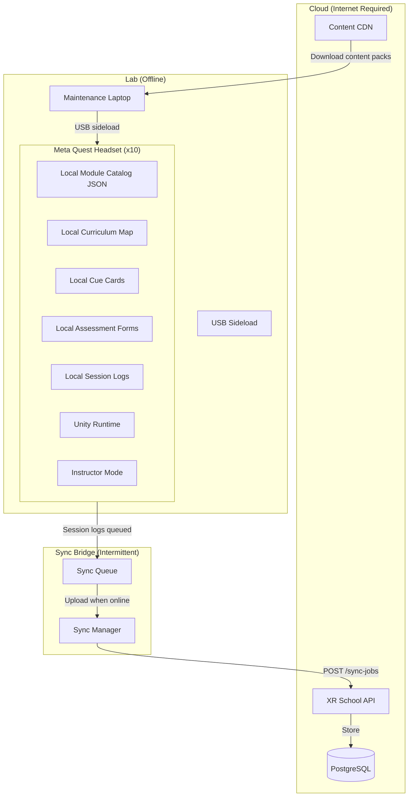
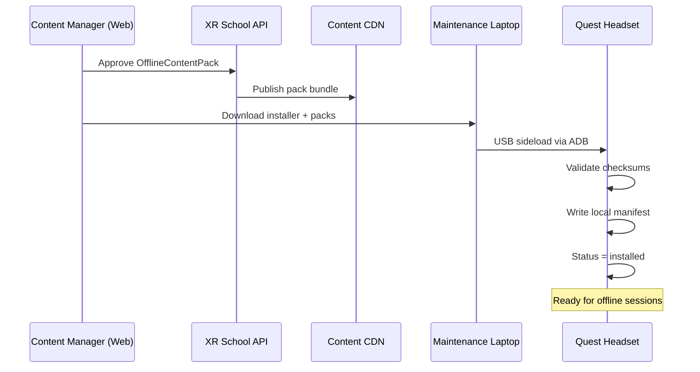
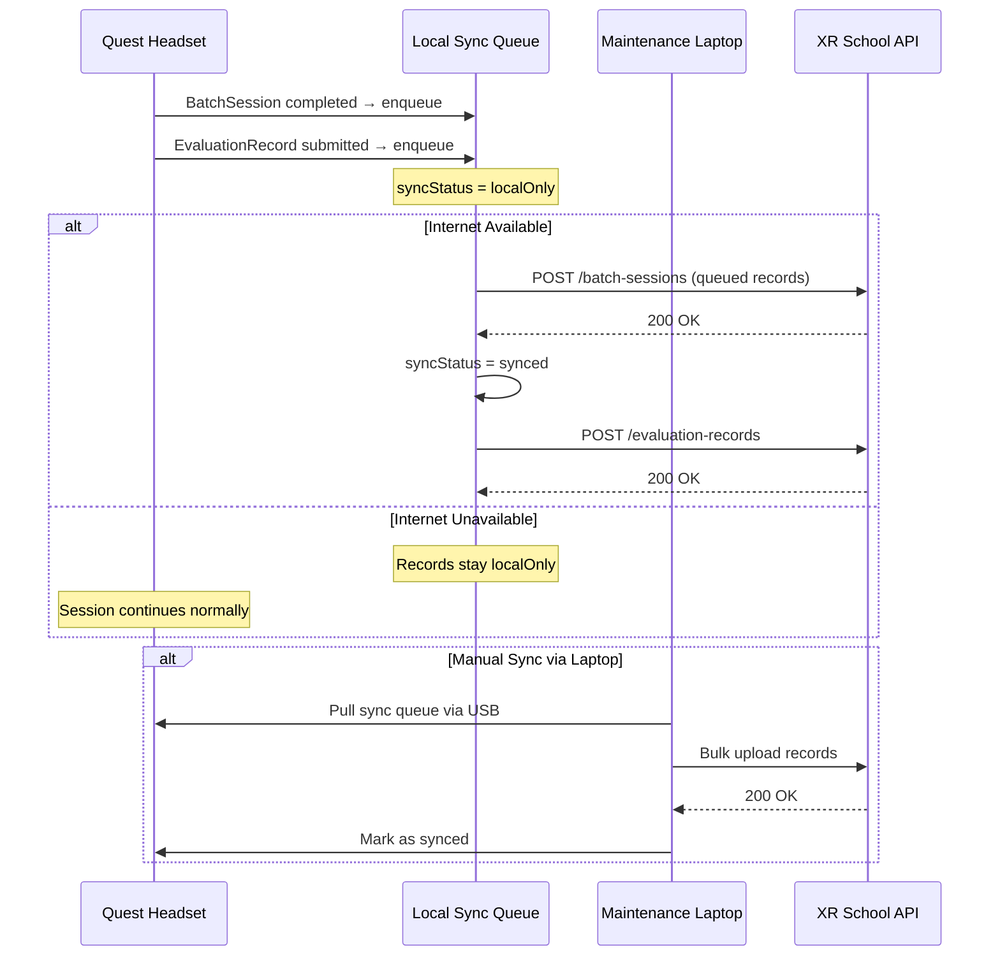
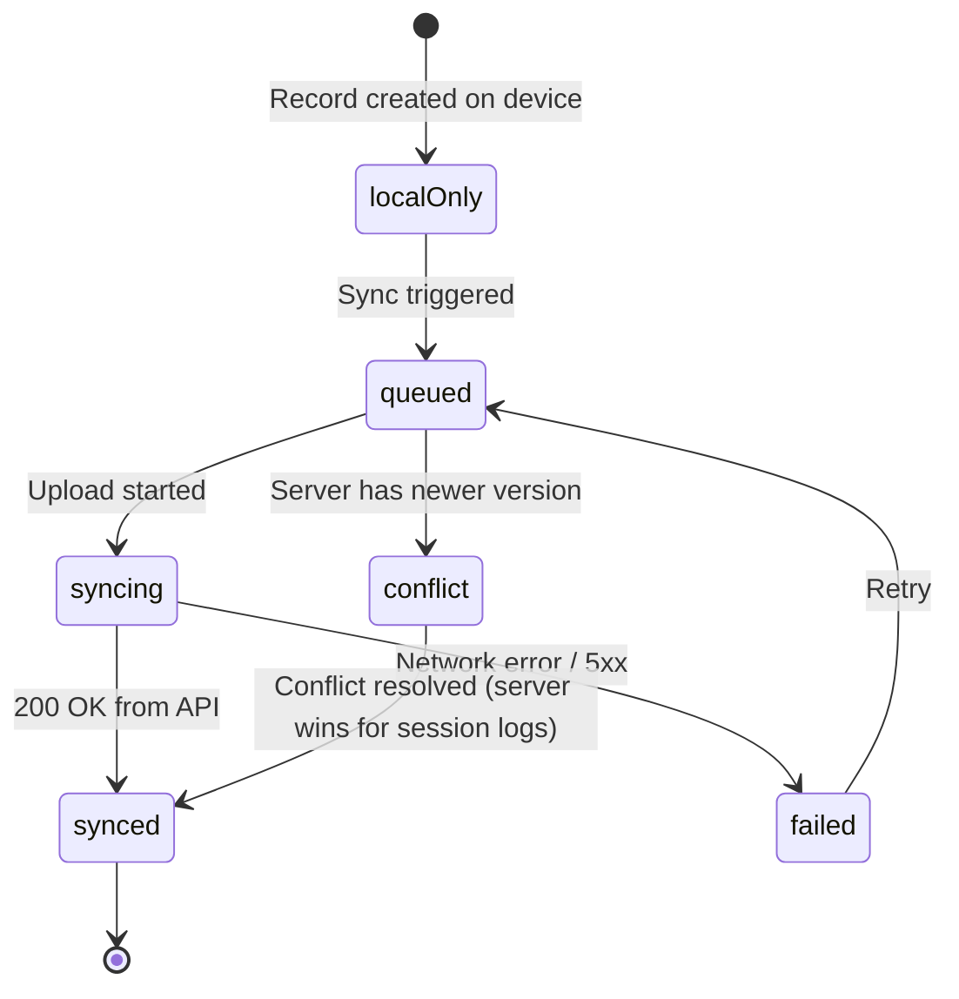

# Offline Quest Deployment Architecture

## Context

Indian schools in North East India have unreliable internet. Sessions cannot depend on connectivity. The Quest app must work fully offline from the moment the headset is picked up.

Internet is used only for:
1. Initial content pack installation (via laptop + USB or USB-C direct sideload)
2. Periodic sync of session logs and evaluation records (when internet is available)

## Architecture Overview



## Content Pack Structure

Content is never installed as a monolithic bundle. Each pack is modular:

```
packs/
  science-class9-physics-v1.2.0/
    manifest.json
    modules/
      atomic-structure/
        metadata.json
        assets/
          scene.bundle          # Unity Addressable bundle
          audio/
          textures/
        cue-cards.json
        revision-cards.json
        assessment-hooks.json
        instructor-script.json
    curriculum-map.json
    version.json
    checksum.sha256
```

### manifest.json Example

```json
{
  "packId": "science-class9-physics-v1.2.0",
  "name": "Class 9 Physics — Core Concepts",
  "version": "1.2.0",
  "releaseChannel": "schoolStable",
  "gradeBands": ["class9To10"],
  "subjects": ["physics"],
  "applicableBoards": ["cbse", "icse"],
  "modules": [
    {
      "moduleId": "atomic-structure-001",
      "slug": "atomic-structure",
      "status": "released",
      "estimatedSizeMb": 420,
      "installStatus": "installed",
      "syncStatus": "synced",
      "checksum": "abc123def456"
    }
  ],
  "totalEstimatedSizeMb": 420,
  "requiresInternetAfterInstall": false,
  "questStorageBudgetGb": 2,
  "installedAt": "2025-06-01T00:00:00Z",
  "lastSyncAt": "2025-06-15T10:30:00Z"
}
```

## Installation Flow



## Session Log Sync Flow



## Quest App Local Data Structure

```
/quest-app/
  data/
    catalog.json              # All installed module metadata
    curriculum-map.json       # Curriculum map reference (read-only)
    session-logs/
      2025-06-10-batch-1.json
      2025-06-10-batch-2.json
    sync-queue/
      pending/
        session-abc123.json
        eval-xyz456.json
      synced/
        (moved here after confirmed upload)
    content-packs/
      science-class9-physics-v1.2.0/
        manifest.json
        ...
  config/
    instructor-config.json    # Current instructor, school, lab assignment
    device-config.json        # Device ID, lab ID, headset number
```

## Offline Sync Status State Machine



## Release Channels

| Channel | Audience | Stability Requirement |
|---|---|---|
| `internal` | Our internal team only | Development/QA builds |
| `pilot` | 1–2 pilot schools | Internally piloted |
| `schoolStable` | All deployed schools | School validated |
| `regionalStable` | Regional rollout ready | Multiple school validation |

**Rule:** A pack must progress through channels in order. No skipping.

## Storage Budget Per Device (128 GB Quest)

| Allocation | Budget |
|---|---|
| Android OS + Meta system | ~12 GB |
| Quest app binary | ~2 GB |
| Reserved (updates, logs) | ~6 GB |
| Content packs | ~108 GB available |

**Guideline:** Target total installed content < 80 GB to leave headroom for updates.

## Device Naming Convention

Each headset should be named:
```
XRS-[SchoolCode]-[LabNumber]-[HeadsetNumber]
e.g., XRS-GHS01-L1-H03
```

Where:
- `XRS` = XR School
- `GHS01` = school code (assigned by program team)
- `L1` = lab 1
- `H03` = headset 3

This name is stored in `device-config.json` and included in all session logs for traceability.
