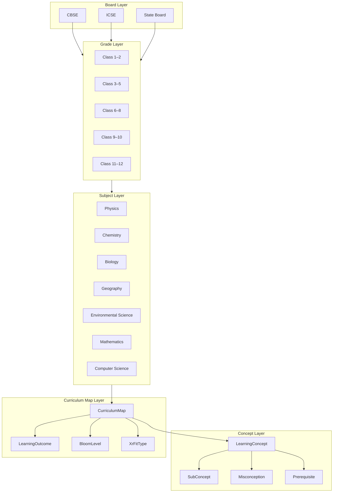
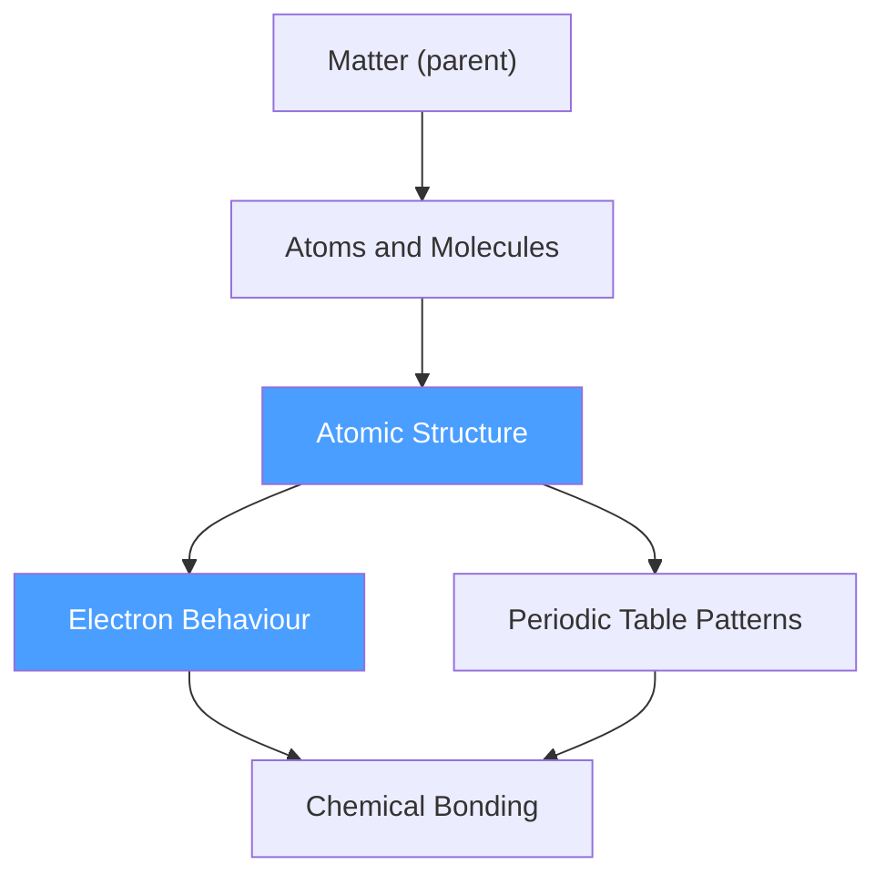

# Curriculum Ontology

The curriculum ontology is a structured graph, not a flat spreadsheet. It captures the relationships between boards, grades, subjects, topics, concepts, and their suitability for XR delivery.

## Ontology Diagram

## CurriculumMap Properties

A `CurriculumMap` record represents a single curriculum node: one topic, for one board, in one grade band, in one subject.

### Required
- `board` — CBSE | ICSE | stateBoard
- `gradeBand` — the grade band
- `subject` — the subject
- `topic` — the specific topic within a chapter
- `conceptIds[]` — which `LearningConcept` records this topic covers
- `learningOutcome` — one measurable learning outcome for this topic
- `bloomLevel` — Bloom's taxonomy level targeted
- `assessmentTypes[]` — how this topic should be assessed
- `revisionImportance` — how critical this is for exams and retention
- `difficultyLevel` — easy | moderate | hard | advanced
- `xrFitType` — the XR suitability classification
- `xrFitJustification` — why this classification was assigned

### Optional but Important
- `stateBoardState` — if stateBoard, which state
- `unit` — the unit/chapter grouping
- `chapter` — specific chapter name
- `subconceptIds[]` — finer-grained concepts within the topic
- `prerequisiteConceptIds[]` — what students must know first
- `misconceptions[]` — common student misunderstandings about this topic
- `languagePackIds[]` — language versions available
- `localContextRelevance` — North East India specific context
- `practicalLabRelevance` — whether a physical lab version exists
- `whyNotTextbookOrVideoOnly` — explicit justification for XR over passive media

## Concept Graph Rules

`LearningConcept` records form a directed acyclic graph:

1. A concept can have one `parentConceptId` (broader concept)
2. A concept can have multiple `prerequisiteConceptIds` (must know before this)
3. Prerequisite relationships must not form cycles
4. Misconceptions are stored on the concept, not the curriculum map (they travel with the concept across boards/grades)

### Example Concept Graph

## Bloom Level Mapping to Learning Techniques

| Bloom Level | Appropriate Techniques in XR |
|---|---|
| `remember` | cueCards, recapCards, visualAnchors |
| `understand` | progressiveReveal, imaginationHelperScenes, conceptPointers |
| `apply` | handsOnInteraction, guidedExploration |
| `analyze` | tryPredictObserveExplain, misconceptionCheck |
| `evaluate` | microQuizzes, beforeAfterUnderstandingChecks, instructorTalkingPoints |
| `create` | batchActivityPrompts (design challenges), handsOnInteraction |

## XR Fit Decision Matrix

Before classifying a topic, answer these questions:

| Question | If Yes → |
|---|---|
| Can the concept be seen at human scale in real life? | `physicalLabBetter` or `normalClassroomBetter` |
| Is the concept invisible, too small, too large, or too dangerous to experience directly? | `strongVrFit` candidate |
| Is the concept spatial or 3D in nature? | `strongVrFit` candidate |
| Would AR overlay add value without full immersion? | `arTabletFit` |
| Is the primary learning from discussion or reading? | `normalClassroomBetter` |
| Is the physical sensation of the experiment part of the learning? | `physicalLabBetter` |
| Does VR add nothing textbook/video can't do? | `notWorthXr` |

## Topics Strong XR Fit — North East India Context

These are curriculum topics where VR is strongly justified for CBSE/ICSE Class 6–12:

| Subject | Topic | XR Advantage |
|---|---|---|
| Physics | Atomic and molecular structure | Atoms are invisible; VR makes them navigable |
| Physics | Electromagnetic waves and spectrum | Waves are invisible; VR renders them tangibly |
| Physics | Laws of motion in space | Zero-gravity is impossible to experience otherwise |
| Chemistry | Chemical bonding (ionic/covalent) | Electron sharing is abstract; VR makes it spatial |
| Chemistry | Periodic table patterns | 3D element property navigation vs flat chart |
| Chemistry | Dangerous reactions (thermite, etc.) | Safe observation of impossible-to-do-in-class reactions |
| Biology | Cell structure and organelles | Cell interior is invisible; VR makes it walkable |
| Biology | DNA structure and replication | Molecular scale impossible to experience; VR makes it navigable |
| Biology | Human circulatory system | Internal body journey impossible physically |
| Geography | Tectonic plates and earthquakes | Geological time scale impossible to experience |
| Geography | Ecosystems of North East India | Virtual field visits to Kaziranga, Loktak Lake |
| Environmental Sci | Water cycle and cloud formation | Atmospheric processes invisible at ground level |
| Physics | Electricity (circuit behaviour) | Current flow is invisible; VR makes it visible |

## State Board Context: North East India

For schools on Assam State Board, Meghalaya State Board, Manipur State Board, etc.:

- Local ecology and biodiversity examples should be prioritised over generic national examples
- Assamese, Bengali, Meitei/Manipuri, Khasi language packs are future priority
- Topics unique to NE India curriculum should be tagged with `localContextRelevance`

Examples of locally relevant context:
- Brahmaputra river ecosystem
- Kaziranga rhino conservation
- Northeast India's biodiversity hotspot status
- Local agricultural practices and soil science
- Monsoon patterns specific to NE India
