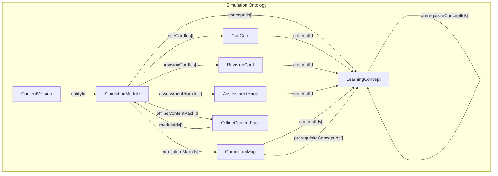
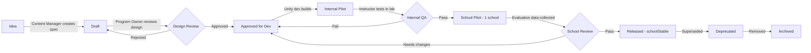

# Simulation Ontology

Every simulation in the XR School Lab Platform must be defined against this ontology. It is not a flat list — it is a structured graph of relationships, constraints, and design requirements.

## Ontology Diagram



## Simulation Required Properties

Every `SimulationModule` must define all of the following. None are optional from a design standpoint (though some are optional in the data model for drafts):

### Identity
- `title` — human-readable name
- `slug` — URL-safe identifier
- `summary` — one paragraph for content managers

### Curriculum Linkage
- `gradeBands[]` — which grade bands this simulation targets
- `subjects[]` — which subjects it covers
- `applicableBoards[]` — CBSE, ICSE, StateBoard
- `stateBoardStates[]` — which state boards if `stateBoard`
- `curriculumMapIds[]` — explicit links to `CurriculumMap` records
- `conceptIds[]` — explicit links to `LearningConcept` records

### Format and Evidence
- `simulationFormat` — immersiveVr | threeSixtyVr | interactive3d | guidedVisualization | practicalLabSimulation | virtualFieldVisit | revisionMode
- `evidenceConfidenceLevel` — experimental | expertDesigned | internallyPiloted | schoolValidated | researchBacked
- `xrFitType` — strongVrFit | arTabletFit | normalClassroomBetter | physicalLabBetter | notWorthXr
- `xrFitJustification` — required text: why XR is better than textbook/video/lab for this topic

### Learning Design
- `learningObjective` — one clear measurable outcome
- `scientificConceptExplanation` — what scientific concept is being taught
- `prerequisiteConceptIds[]` — what students must understand first
- `misconceptionsAddressed[]` — common wrong beliefs this simulation corrects
- `visualizationStrategy` — how the concept is made visible
- `interactionStrategy` — how students interact with the simulation
- `imaginationHelperStrategy` — for abstract concepts: how the simulation aids imagination

### Instructor Design
- `instructorScript` — full talking points and facilitation guide
- `batchActivityPrompt` — what the instructor asks the full class (not just headset batch)
- `expectedDurationMinutes` — planned session length
- `maxSessionDurationMinutes` — hard upper limit for safety

### Safety
- `comfortRiskLevel` — low | medium | high
- `safetyNotes[]` — specific comfort or safety instructions

### Assessment
- `cueCardIds[]` — in-simulation concept prompts
- `revisionCardIds[]` — post-session spaced revision cards
- `assessmentHookIds[]` — pre/post/micro quiz hooks

### Packaging
- `offlineContentPackId` — which offline pack bundles this module
- `estimatedPackageSizeMb` — for storage budgeting
- `targetFrameRateFps` — performance target (72fps minimum for Quest)
- `minQuestStorageGb` — minimum device storage required

## XR Fit Classification Rules

| Classification | Meaning | Example Use |
|---|---|---|
| `strongVrFit` | VR provides irreplaceable advantage | Atomic structure, space exploration, dangerous chemical reactions |
| `arTabletFit` | AR on tablet would work better or additionally | Overlaying cell structures on paper diagrams |
| `normalClassroomBetter` | Discussion, debate, teacher explanation is more effective | Literature interpretation, ethical discussions |
| `physicalLabBetter` | Hands-on physical experiment is better | Titration, dissection (where permitted), actual plant growth |
| `notWorthXr` | XR adds no value over existing tools | Simple arithmetic, reading comprehension |

**Rule:** No simulation with `xrFitType: normalClassroomBetter`, `physicalLabBetter`, or `notWorthXr` should be built. These classifications exist to reject bad ideas, not describe built simulations.

## Learning Technique Taxonomy

Every simulation should explicitly implement one or more of these techniques:

| Technique | Description |
|---|---|
| `cueCards` | Floating prompts that focus attention on key observations |
| `conceptPointers` | Visual arrows or highlights pointing to relevant elements |
| `visualAnchors` | Persistent on-screen labels for spatial orientation |
| `guidedExploration` | Student has agency but instructor narrows focus |
| `progressiveReveal` | Concepts revealed in sequence, not all at once |
| `tryPredictObserveExplain` | Student predicts, then watches, then explains |
| `microQuizzes` | 1–3 question check embedded in simulation flow |
| `misconceptionCheck` | Forces confrontation with common wrong belief |
| `revisionMode` | Separate mode to replay key moments with quiz overlay |
| `recapCards` | End-of-simulation summary cards |
| `spacedRevisionHooks` | Tags that suggest when to revisit |
| `beforeAfterUnderstandingChecks` | Pre and post understanding scored questions |
| `instructorTalkingPoints` | On-screen notes only visible in instructor mode |
| `batchActivityPrompts` | Activities designed for the whole class while one batch wears headsets |
| `handsOnInteraction` | Physical interaction with virtual objects |
| `imaginationHelperScenes` | Scenes designed specifically for abstract concepts like atoms, forces, time |

## Simulation Lifecycle States

```
IDEA → DESIGN_DRAFT → CONTENT_REVIEW → INTERNAL_PILOT → SCHOOL_PILOT → RELEASED → DEPRECATED
```

Tracked via `ContentPackStatus` on `SimulationModule`:
- `draft` — idea documented, not built
- `approved` — design reviewed and approved for development  
- `released` — deployed to schools
- `deprecated` — superseded or retired
- `archived` — removed from catalog

## Simulation Lifecycle Diagram


