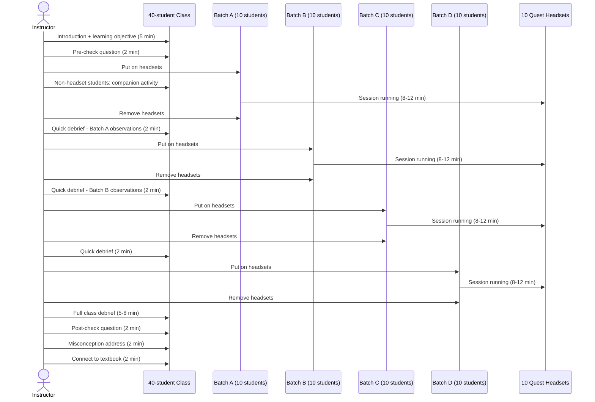

# Batch Rotation Model

## Context

- 40 students per class
- 10 Meta Quest headsets per lab
- 4 batches of 10 students each
- Instructor runs the full class rotation

This document defines how batch sessions are structured, logged, and evaluated.

## Rotation Flow



## Total Session Duration

| Phase | Duration |
|---|---|
| Introduction + pre-check | 7 min |
| Batch A (rotation 1) | 10–14 min |
| Batch B (rotation 2) | 10–14 min |
| Batch C (rotation 3) | 10–14 min |
| Batch D (rotation 4) | 10–14 min |
| Final debrief + post-check | 11 min |
| **Total** | **~58–75 min** |

This fits within a standard 60-minute class period with some compression. For 75-minute periods, there is room for richer debrief.

## BatchSession Data Model

Each batch of 10 students generates one `BatchSession` record:

```json
{
  "id": "bs-001",
  "schoolId": "school-abc",
  "labDeploymentId": "lab-xyz",
  "instructorId": "instr-001",
  "moduleId": "atomic-structure-001",
  "gradeBand": "class9To10",
  "batchNumber": 1,
  "batchSize": 10,
  "totalClassSize": 40,
  "plannedStartTime": "2025-06-15T09:00:00Z",
  "actualStartTime": "2025-06-15T09:07:00Z",
  "actualEndTime": "2025-06-15T09:19:00Z",
  "anonymousParticipantCount": 10,
  "headsetCountUsed": 10,
  "offline": true,
  "syncStatus": "localOnly"
}
```

Four `BatchSession` records are created per class session (one per batch). They all reference the same module and same instructor.

## EvaluationRecord Relationship

One `EvaluationRecord` is created per `BatchSession`. It captures batch-level outcomes:

- **Pre-check score:** Recorded before headsets go on for the first batch (applies to whole class)
- **Post-check score:** Recorded after all batches complete (applies to whole class)
- **Engagement score:** Instructor observation of how engaged the batch was during simulation
- **Completion rate:** What percentage of the simulation was completed before time was called
- **Misconceptions detected:** What wrong beliefs the instructor observed during debrief
- **Confusion points:** What moments in the simulation caused visible confusion

## Instructor Headset Management

### Before Session
1. Power on all 10 headsets (from charging dock)
2. Verify all headsets show correct module loaded
3. Confirm offline mode active (no internet needed)
4. Adjust straps and IPD for first batch size range

### During Session
1. Walk around batch during simulation
2. Note any student looking uncomfortable (nausea, disorientation)
3. Stop any student who signals discomfort
4. Begin timing from when last headset is on

### After Each Batch
1. Collect headsets
2. Return to charging dock if batch gap > 5 minutes
3. Log batch start/end time in instructor tablet app
4. Note any comfort issues immediately

### Safety Rules
- No student wears a headset for more than one session per day
- Any student showing nausea symptoms sits out remaining batches
- High-comfort-risk simulations: instructor pre-briefs seated position
- No running or sudden movement with headsets on

## Companion Activity Examples

Non-headset students (30 of 40) should not be idle. Companion activities per simulation:

| Simulation | Companion Activity |
|---|---|
| Atomic Structure | Draw a Bohr model; label protons, neutrons, electrons |
| Cell Biology | Label a blank cell diagram from memory |
| Tectonic Plates | Mark plate boundaries on a blank world map |
| Electrical Circuits | Complete a circuit diagram with correct symbols |
| Human Circulatory System | Trace blood flow on a body outline |

## Instructor Tablet App (Future)

In MVP, session logging is done on a basic web form. The instructor tablet app (native or PWA) is a future priority:

- Batch timer with automatic prompts
- Batch session creation pre-filled from schedule
- Comfort issue quick-log
- Evaluation form auto-opened after each batch
- Sync status indicator

## Scheduling Model

Each school deployment has a defined schedule:
- Which class visits the lab on which day
- Target: 4–5 lab visits per class per term
- Each visit: 1 simulation module
- 8 modules per year = strong curriculum coverage for core XR-fit topics

**Scheduling is manual in MVP.** A scheduling interface is a future feature.
