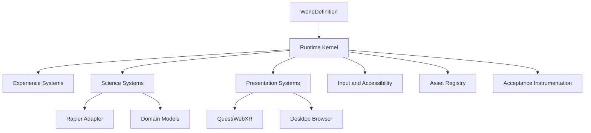
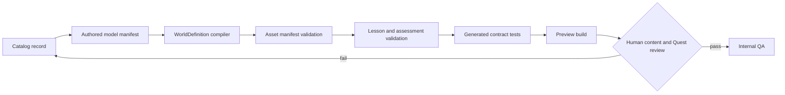

# World Builder Quality and Reference Worlds Design

**Date:** 29 June 2026
**Status:** Approved design, pending written-spec review
**Platforms:** Meta Quest Browser/WebXR and desktop browsers
**Delivery mode:** Shared foundation followed by one independently verified production release per existing simulation

## Objective

Build a reusable simulation world-builder architecture that raises visual fidelity, scientific trustworthiness, and educational value without sacrificing Meta Quest comfort or making scientific complexity visible to students.

The system must:

- give every simulation physically based lighting and materials with well-defined image maps;
- apply post-processing only when the active device profile can sustain it;
- use deterministic fixed-step runtime behavior;
- keep scientific equations, units, assumptions, and numerical validation internal;
- show students clear, age-appropriate cause and effect;
- use intuitive mastery checks that test observation, misconception correction, and transfer;
- retouch and release the five existing simulations individually;
- block bulk generation until all five reference simulations prove the shared architecture;
- keep specifications, ontology documentation, tests, and release gates synchronized.

## Decisions

The following decisions were approved during design:

1. **Adaptive quality tiers:** Quest receives a high-quality performance-safe PBR baseline; capable browsers receive additional post-processing and higher presentation budgets.
2. **Hidden scientific complexity:** formulas, units, solvers, model ranges, and numerical assumptions are implementation concerns. Students see stable outcomes, clear language, and meaningful evidence.
3. **Composition-based world builder:** simulations compose systems through a declarative world definition. They do not inherit from large subject-specific base classes and do not each own a separate render loop.
4. **Reference worlds before generation:** Pollination, Circuit, States of Matter, Solubility, and Food Sources are migrated and released one at a time. The bulk generator remains disabled until those five migrations pass.
5. **Release order:** World Builder Foundation, Pollination, Circuit, States of Matter, Solubility, Food Sources, then the validated generation pipeline.

## Architectural Approach

### Why Composition

The platform will use an explicit `WorldDefinition` assembled from focused systems. This preserves reuse while keeping subject behavior independent.

The rejected alternatives are:

- a full entity-component-system rewrite, which would delay educational improvements and introduce unnecessary infrastructure;
- archetype inheritance, which would make rendering, physics, and assessment behavior increasingly coupled and difficult to validate.

### Runtime Layers



The runtime kernel owns:

- renderer, scene, camera rig, XR session, and device profile;
- one accumulator-based clock;
- fixed updates for physical and scientific behavior;
- per-frame presentation updates;
- system initialization order;
- pause, resume, and XR session transitions;
- controller and browser input routing;
- resource registration and deterministic disposal;
- diagnostics and performance counters;
- local session and aggregate assessment state.

Individual simulations own:

- world content and entity declarations;
- subject-specific model configuration;
- authored lesson stages;
- misconceptions and mastery evidence;
- simulation-specific visual assets;
- explicit acceptance thresholds.

## Core Contracts

The shared simulation schema will add these contracts.

```ts
type QualityProfileId = 'questBaseline' | 'browserBalanced' | 'browserEnhanced';

interface WorldDefinition {
  id: string;
  version: string;
  title: string;
  metersPerWorldUnit: number;
  environmentId: string;
  qualityProfileIds: QualityProfileId[];
  entityIds: string[];
  systemIds: string[];
  scientificModelIds: string[];
  lessonSequenceId: string;
  assessmentSequenceId: string;
  assetManifestId: string;
  acceptanceProfileId: string;
}

interface WorldEntityDefinition {
  id: string;
  visualId: string;
  transform: {
    position: [number, number, number];
    rotation: [number, number, number];
    scale: [number, number, number];
  };
  materialId?: string;
  colliderId?: string;
  interactionTags: string[];
  accessibilityLabel?: string;
}

interface WorldSystemPlugin {
  id: string;
  dependencies: string[];
  initialize(context: WorldContext): void | Promise<void>;
  fixedUpdate?(context: FixedUpdateContext): void;
  renderUpdate?(context: RenderUpdateContext): void;
  pause?(context: WorldContext): void;
  resume?(context: WorldContext): void;
  dispose(context: WorldContext): void;
}
```

System dependency cycles, duplicate IDs, unresolved entities, missing assets, unsupported quality profiles, and missing dispose handlers are validation failures.

### Deterministic Loop

The runtime uses a fixed simulation step of `1 / 60` seconds with an accumulator and no more than four catch-up steps per rendered frame.

```ts
accumulator += Math.min(frameDeltaSeconds, 0.1);
while (accumulator >= fixedStep && substeps < 4) {
  runFixedSystems(fixedStep);
  accumulator -= fixedStep;
  substeps++;
}
runPresentationSystems(accumulator / fixedStep);
```

This loop keeps numerical behavior independent from display refresh rate. Presentation may interpolate transforms, but interpolation must never change scientific state or assessment results.

If a device falls behind:

1. presentation quality is reduced;
2. optional effects are disabled;
3. texture or shadow budgets may be lowered at a safe transition;
4. scientific timesteps and authored lesson outcomes are never skipped or fabricated.

## Rendering and Environment Standard

### Physically Based Material Contract

All instructional meshes use `MeshStandardMaterial` by default. `MeshPhysicalMaterial` is reserved for materials that require physical transmission, clearcoat, sheen, or iridescence, because it has higher per-pixel cost.

```ts
interface PbrMaterialDefinition {
  id: string;
  model: 'standard' | 'physical';
  baseColor: string;
  baseColorMap?: string;
  normalMap?: string;
  roughness: number;
  roughnessMap?: string;
  metalness: number;
  metalnessMap?: string;
  ambientOcclusionMap?: string;
  emissiveColor?: string;
  emissiveMap?: string;
  emissiveIntensity?: number;
  transmission?: number;
  clearcoat?: number;
  iridescence?: number;
  doubleSided?: boolean;
  opacity?: number;
}
```

Rules:

- color maps use `SRGBColorSpace`;
- normal, roughness, metalness, and AO maps remain non-color data;
- normal scale and texture repeat must be defined explicitly;
- anisotropy is capped by the selected quality profile;
- texture dimensions are powers of two unless a documented asset exception exists;
- transparent layers are minimized and render ordering is explicit;
- materials that represent the same physical substance reuse one definition;
- unlit/basic materials are limited to labels, controller rays, diagnostic overlays, and deliberately emissive educational cues.

Texture sources must be self-authored, procedurally generated, or licensed for redistribution. Every asset manifest records source, license, author, dimensions, channels, compression, and fallback.

### Lighting and Environment

Every world has an `EnvironmentDefinition`:

```ts
interface EnvironmentDefinition {
  id: string;
  background: { kind: 'color' | 'gradient' | 'texture'; value: string };
  environmentMap?: string;
  fog?: { color: string; near: number; far: number };
  keyLight: LightDefinition;
  fillLight?: LightDefinition;
  accentLights: LightDefinition[];
  shadowCasters: string[];
  exposure: number;
  toneMapping: 'AgX' | 'ACESFilmic' | 'Neutral';
}
```

Image-based lighting uses a PMREM-filtered environment map or a procedural environment scene. This provides roughness-aware reflections consistent with Three.js PBR shading. Each world must still maintain readable forms without an environment map by using its approved fallback lighting rig.

Lighting rules:

- one shadow-casting key light on Quest unless an acceptance profile explicitly allows more;
- fill and accent lights do not cast shadows by default;
- important interaction targets maintain adequate luminance contrast;
- no strobe, unbounded bloom, sudden exposure changes, or high-frequency shadow flicker;
- lighting changes support lesson stages rather than decoration;
- world scale, light attenuation, and shadow camera bounds are explicit.

### Adaptive Quality Profiles

| Budget | Quest Baseline | Browser Balanced | Browser Enhanced |
|---|---:|---:|---:|
| Required steady frame rate | 72 fps | 60 fps | 60 fps |
| Visible triangles | 250,000 | 500,000 | 750,000 |
| Draw calls | 120 | 220 | 300 |
| Standard texture ceiling | 1024 px | 2048 px | 2048 px |
| Shadow-casting lights | 1 | 1 | 2 |
| Shadow map ceiling | 1024 px | 2048 px | 2048 px |
| Full-screen post-processing | none required | antialias/output | AO + selective bloom + antialias/output |
| Pixel ratio ceiling | device-tested | 1.5 | 2 |

These are maximum budgets, not targets. Acceptance profiles may define lower limits for complex worlds.

Quest rendering uses direct WebXR rendering with calibrated tone mapping, PBR materials, PMREM lighting, fog, renderer antialiasing, and disciplined shadows. Desktop profiles may use `EffectComposer` with:

- `RenderPass`;
- output/color-space pass;
- SMAA or FXAA according to capability;
- subtle ambient occlusion;
- selective bloom for genuinely emissive educational elements.

Depth of field, film grain, chromatic aberration, heavy motion blur, and ornamental vignette are excluded because they can reduce legibility or imply misleading focus.

Official implementation references:

- [Three.js MeshPhysicalMaterial](https://threejs.org/docs/pages/MeshPhysicalMaterial.html)
- [Three.js PMREMGenerator](https://threejs.org/docs/pages/PMREMGenerator.html)
- [Three.js post-processing guide](https://threejs.org/manual/en/post-processing.html)

## Scientific Fidelity Standard

### Physics Is Not One Solver

Rapier is used for rigid-body motion, contacts, colliders, sensors, and joints. It is not used as a substitute for electricity, thermodynamics, chemistry, biology, or semantic classification.

The runtime will remove the duplicate browser physics implementation and expose one shared adapter around the canonical `packages/simulation-runtime` contract.

Rapier is selected for contact behavior because its JavaScript/WASM implementation supports deterministic operation when initial conditions, insertion order, version, and timestep are controlled. See [Rapier determinism](https://rapier.rs/docs/user_guides/javascript/determinism/).

### Scientific Model Manifest

Every subject model declares:

```ts
interface ScientificModelManifest {
  id: string;
  version: string;
  domain: 'biology' | 'electricity' | 'particleMatter' | 'mixtures' | 'classification';
  internalUnits: Record<string, string>;
  validInputRanges: Record<string, { min: number; max: number; unit: string }>;
  assumptions: string[];
  limitations: string[];
  referenceSources: string[];
  referenceVectors: ScientificReferenceVector[];
  numericalTolerance: number;
}

interface ScientificReferenceVector {
  id: string;
  inputs: Record<string, number | string | boolean>;
  expectedOutputs: Record<string, number | string | boolean>;
  toleranceOverrides?: Record<string, number>;
}
```

All numeric models use SI units internally unless a manifest documents another canonical unit. Display conversions are presentation-only.

Rules:

- model inputs are range-checked;
- `NaN`, infinity, invalid units, and undefined states stop the interaction;
- invalid scientific state must never be replaced with a plausible animation;
- numerical error must remain below the model tolerance;
- reference vectors include boundaries and misconception-relevant cases;
- random behavior uses seeded sources and cannot alter the correct conceptual outcome;
- changes to a scientific model version require updated reference vectors and documentation.

### Hidden Complexity

Students will not see formula panels, numerical solver details, scientific assumptions, or model debugging interfaces during the normal lesson.

Students will see:

- the variable they control;
- the evidence that changes;
- a clear comparison when relevant;
- concise narration and labels;
- a prompt asking them to interpret the evidence.

Instructor and developer diagnostics are separate modes and never appear accidentally in the student world.

## Assessment and Mastery Standard

Every upgraded simulation uses a common `AssessmentSequence`.

```ts
interface AssessmentSequence {
  id: string;
  objectiveId: string;
  prompts: AssessmentPromptDefinition[];
  masteryRule: MasteryRule;
}

interface AssessmentPromptDefinition {
  id: string;
  kind: 'prediction' | 'observation' | 'misconception' | 'transfer';
  stageId: string;
  question: string;
  options?: { id: string; label: string }[];
  acceptedEvidenceIds: string[];
  hint: string;
  explanation: string;
  retryPolicy: 'immediateWithHint' | 'afterObservation';
}

interface MasteryRule {
  requiredEvidenceCount: number;
  requiredKinds: ('observation' | 'misconception' | 'transfer')[];
  allowHintedMastery: boolean;
}
```

Assessment flow:

1. learner predicts where prediction is instructionally useful;
2. learner performs or observes the relevant interaction;
3. learner identifies evidence visible in the scene;
4. learner resolves the primary misconception;
5. learner answers one transfer prompt using a new example.

Prompt rules:

- one concept per prompt;
- vocabulary matches the target class level;
- options are mutually distinguishable and do not rely on trick wording;
- incorrect feedback points to observable evidence rather than merely reporting failure;
- a hint appears after an incorrect response;
- retry is allowed without punitive score animation;
- mastery requires at least two independent evidence points;
- one required evidence point addresses a named misconception;
- one required evidence point is a transfer beyond the exact rehearsed interaction.

The platform records aggregate session evidence only. It does not introduce individual student accounts.

## Reference World Releases

Each release keeps `releaseMaturity: internalQA` until direct Quest acceptance is signed. Deployment does not automatically promote maturity.

### W0: World Builder Foundation

W0 delivers:

- world, entity, environment, material, asset, science-model, lesson, assessment, and acceptance schemas;
- runtime lifecycle and fixed-step clock;
- resource registry with deterministic disposal;
- Three.js renderer and camera-rig factory;
- adaptive quality-profile selection and safe downgrade;
- texture/material/environment factories;
- Rapier initialization and canonical physics adapter;
- scientific-model registry;
- input router shared by browser and Quest;
- common lesson-stage and assessment state machines;
- narration adapter;
- diagnostics, frame-budget instrumentation, and release evidence output;
- migration adapter allowing one existing viewer at a time to move into the world builder.

W0 acceptance:

- lifecycle initialize/pause/resume/dispose tests;
- fixed-step determinism tests;
- resource leak tests;
- quality selection and downgrade tests;
- material color-space and required-map validation;
- Rapier contact reference tests;
- error-fallback tests;
- one minimal diagnostic reference world in browser and WebXR-compatible mode.

### W1: Pollination

Visual upgrade:

- mapped soil, stems, leaves, petals, bark, bee body, and wing materials;
- PMREM garden environment and calibrated sun/fill rig;
- controlled soft shadows and depth fog;
- improved plant silhouettes and consistent biological scale;
- browser-only subtle AO and bloom limited to pollen/cue emphasis;
- Quest-safe instancing for flowers, foliage, and pollen.

Science model:

- authored biological event graph for flower structure, pollen transfer, fertilisation, seed formation, and germination;
- pollen and bee motion remain illustrative but cannot violate stage causality;
- seed/germination state requires the correct preceding events;
- scale disclaimers are encoded in authored presentation metadata, not displayed as formula text.

Mastery:

- sequence the reproduction stages;
- distinguish pollination from fertilisation using visible evidence;
- transfer the concept to a new pollinator or wind-pollinated example.

### W2: Circuit

Visual upgrade:

- mapped wood, PCB, copper, plastic, rubber, ceramic resistor, brushed metal, and glass;
- environment reflections for metal and glass;
- calibrated bulb emission and selective bloom on browser;
- physically consistent switch geometry and contact feedback.

Science model:

- voltage source and resistor values use SI units;
- `I = V / R`;
- `P = V × I` and `P = I²R` are cross-checked within tolerance;
- bulb brightness uses a documented normalized power-response curve with a bounded thermal lag;
- charge-flow visualization speed is derived from current for comparison but is explicitly an educational visualization, not electron drift scale;
- open circuits produce zero steady current.

Reference vectors include all supplied 9 V resistor cases, open/closed switch states, zero/invalid resistance handling, and power consistency.

Mastery:

- predict current and brightness after a resistance change;
- reject “current is used up” using before/after path evidence;
- transfer to a new voltage/resistance pair without exposing internal implementation formulas in the UI.

### W3: States of Matter

Visual upgrade:

- mapped chamber, metal frame, glass, frost, condensation, and controls;
- clear particle visibility without excessive emissive glow;
- environment lighting that preserves spacing and motion legibility;
- adaptive instancing and particle budgets.

Science model:

- conserved particle count;
- temperature controls a bounded kinetic-energy distribution;
- solid particles vibrate around lattice anchors;
- liquids use short-range cohesion with bounded mobility;
- gases use container collisions and wider separation;
- phase transitions follow authored energy thresholds and hysteresis to prevent flicker;
- particle visuals are a reduced educational model and do not claim molecular-scale geometry or time.

Mastery:

- infer state from arrangement and motion;
- correct the belief that solid particles do not move;
- transfer by predicting the effect of heating or cooling a new sample.

### W4: Solubility

Visual upgrade:

- mapped bench, vessel glass, water, powder, crystals, sand, chalk, oil, labels, and utensils;
- physical transmission limited to browser profiles when affordable;
- Quest uses layered transparent materials with reduced transmission resolution;
- clear sediment, cloudiness, dissolution, and oil-layer cues.

Science model:

- substance records define qualitative solubility class, density relation, particle presentation, and observation outcome;
- dissolving, suspension/clouding, sedimentation, and immiscible layering are distinct states;
- stirring changes observation timing but never changes an insoluble substance into a soluble one;
- visual Brownian motion is illustrative and cannot alter the recorded outcome;
- a reset restores identical initial conditions.

Mastery:

- make and compare predictions;
- select the observation that supports an outcome;
- distinguish dissolving from disappearing, floating, melting, and settling;
- transfer to a new household material and fair-test plan.

### W5: Food Sources

Visual upgrade:

- mapped pantry/table, produce, grains, dairy, eggs, fish, honey, and mushroom assets;
- coherent market/farm environment lighting;
- optimized reusable geometry and texture atlases;
- accessible source icons in addition to color.

Science model:

- semantic classification dataset with plant, animal, and fungal sources;
- ingredient records separate everyday food names from biological source;
- interaction physics support picking and placement only;
- correct classification comes from authored biological data, never collision behavior.

Mastery:

- classify representative ingredients;
- correct the mushroom, honey, and milk misconceptions;
- transfer by breaking a mixed meal into ingredients and classifying each source.

## Validated Generation Pipeline

The generator remains gated until W1–W5 are released and all reference-world capability reports pass.

Generation flow:



The generator fails closed when:

- no approved scientific model capability exists;
- a catalog record requests an unsupported system;
- an asset lacks provenance, license, compression metadata, or fallback;
- a material violates the active quality budget;
- the lesson omits misconception or transfer evidence;
- generated IDs or references collide;
- reference vectors are missing;
- the predicted Quest budget exceeds the acceptance profile.

Generated worlds begin as `inDevelopment`. Passing automated generation does not promote a world to `internalQA`.

## Error Handling

| Failure | Runtime behavior | Release consequence |
|---|---|---|
| Texture/map load failure | Use the declared fallback material and emit a diagnostic | Fails asset acceptance until corrected |
| Environment map failure | Use the approved fallback lighting rig | Fails visual acceptance until corrected |
| Optional post-process unsupported | Select the next lower quality profile | Allowed if readability and frame rate pass |
| Scientific input invalid | Stop that interaction, preserve last valid state, emit diagnostic | Hard release blocker |
| Scientific model throws | Pause lesson progression and show a neutral retry message | Hard release blocker |
| Frame budget exceeded | Disable optional presentation features in declared order | Hard blocker if Quest cannot sustain 72 fps at baseline |
| Assessment data unavailable | Continue locally and retain session evidence in memory | No fabricated mastery; release requires recovery test |
| XR input source unsupported | Keep browser controls and supported controller actions operational | Requires documented compatibility result |
| Resource disposal failure | Force renderer/session cleanup and emit leaked resource IDs | Hard release blocker |

## Testing Strategy

### Unit Tests

- world definition and reference integrity;
- lifecycle dependency ordering and disposal;
- fixed-step accumulator, catch-up cap, and determinism;
- material definitions, map color spaces, fallbacks, and budgets;
- quality-profile detection and downgrade ordering;
- scientific model input validation and reference vectors;
- Rapier adapter contacts, sensors, impulses, and snapshots;
- lesson-stage transitions;
- assessment hint, retry, misconception, transfer, and mastery rules;
- generator fail-closed conditions.

### Integration Tests

- one world mounts, enters browser mode, enters/exits WebXR-compatible mode, pauses, resumes, and disposes;
- browser and Quest input maps produce the same semantic actions;
- renderer quality changes never alter scientific state;
- narration, lesson stages, scientific events, and assessment evidence remain synchronized;
- each migrated reference world runs through its complete learning path;
- stale generated artifacts fail CI.

### Browser and Visual Tests

Playwright will verify:

- launch, browser-mode entry, interaction targets, and back navigation;
- assessment prompts and feedback;
- no console errors or unhandled resource failures;
- deterministic seeded screenshots at defined lesson checkpoints;
- renderer diagnostics remain within browser budgets.

Pixel comparisons use fixed camera, seed, viewport, and color profile. They supplement semantic and material tests; they are not the only visual acceptance signal.

### Quest Acceptance

Desktop automation cannot certify headset comfort. Every reference-world release requires a recorded Quest checklist:

- stable 72 fps at Quest baseline;
- controller ray, trigger, thumbstick, B/X, and navigation panel;
- readable labels and cues at headset resolution;
- no discomfort-inducing movement, flashes, exposure changes, or UI placement;
- correct lifecycle through session start and end;
- complete learning and assessment path;
- no visible fallback materials or missing assets;
- device temperature and memory remain within an approved test-session envelope.

## Release Pipeline Optimization

The current Quality workflow repeats dependency installation across multiple jobs and treats typecheck/lint failures as optional. The revised pipeline will use:

1. one dependency installation in the main verification job with npm caching;
2. contract compile and generated-artifact freshness check;
3. catalog/world/model/lesson validation;
4. unit tests with coverage thresholds for world-builder and scientific-model packages;
5. strict web typecheck;
6. strict lint for changed source areas;
7. Playwright browser interaction and deterministic visual probes;
8. one production Next.js build;
9. deployment only after verification succeeds;
10. production smoke checks against the exact commit.

Pull requests run verification without production deployment. Direct `main` releases run verification, deploy, and production smoke checks. Concurrency cancellation remains enabled so superseded builds do not deploy.

The release workflow records:

- commit SHA;
- world and model versions;
- generated artifact hashes;
- unit/integration/visual results;
- browser performance report;
- manual Quest acceptance status;
- deployed production URL.

Warnings for missing coverage artifacts are removed by either generating the declared artifacts or removing invalid upload paths. Node and action versions will match the repository engine policy.

## Documentation Maintenance

Implementation updates these documents alongside code:

- `docs/simulation-design/simulation-design-system.md` for rendering, hidden science, assessment, and acceptance standards;
- `docs/ontology/simulation-ontology.md` for world, model, assessment, asset, and acceptance relationships;
- a world-builder architecture document with lifecycle and plugin contracts;
- one release note and acceptance record per reference world;
- model reference documentation for each scientific domain;
- asset provenance manifests;
- generator capability matrix after W5.

Spec drift checks will require:

- schema changes plus ontology updates;
- world-builder component changes plus Storybook coverage where applicable;
- scientific model changes plus reference-vector tests;
- generated files plus their source definitions;
- release maturity changes plus acceptance evidence.

## Acceptance Criteria

The program is complete when:

- all simulations use the shared world lifecycle and resource registry;
- no viewer owns an independent duplicate physics implementation;
- each instructional surface uses a validated PBR material or approved label material;
- all five worlds pass their scientific reference vectors;
- all five worlds include misconception and transfer mastery evidence;
- all five worlds pass browser interaction, visual, production build, and deployment checks;
- all five worlds have a completed Quest acceptance record;
- each world has been released and production-verified independently;
- the generator rejects unsupported or scientifically unvalidated catalog rows;
- the release pipeline has no optional typecheck/lint gates or invalid artifact warnings;
- specifications, ontology, model references, asset manifests, tests, and deployment records are synchronized.

## Explicit Non-Goals

- exposing equations or solver controls in the normal student interface;
- using cinematic post-processing that reduces legibility or comfort;
- simulating molecular chemistry or biology with rigid-body physics;
- claiming molecular scale, time, or motion where the lesson uses an educational reduced model;
- generating all remaining catalog simulations before the five reference worlds pass;
- promoting any simulation to `pilotReady` or `schoolValidated` without the existing maturity evidence requirements;
- adding individual student accounts or identity tracking.
