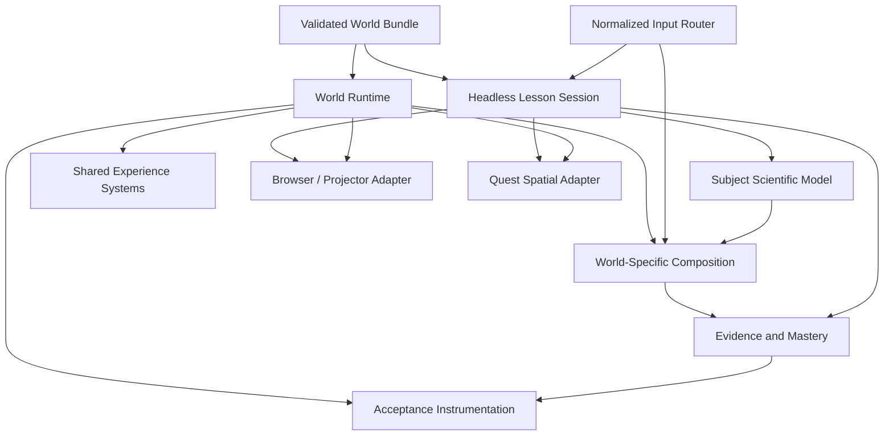

# Immersive Simulation Foundation and Reference-World Retouch

**Date:** 3 July 2026  
**Status:** Approved design, pending written-spec review  
**Primary platforms:** Meta Quest Browser/WebXR and desktop browsers  
**Initial reference worlds:** Pollination, Circuit, States of Matter  
**Subsequent migrations:** Solubility, Food Sources, Digestive System

## Objective

Raise the completed simulations to a world-class experiential and visual standard by improving the shared world-builder foundation first, proving it through three reference worlds, and then migrating the remaining completed simulations.

The result must feel like performing an experiment inside a detailed, correctly scaled, 360-degree environment. It must not feel like advancing through floating slides. Every world will use the shared foundation while retaining its own authored environment, scale, tools, materials, lighting, sound, interactions, and scientific behavior.

Browser/projector and Quest experiences have equal product importance. They use the same learning and scientific state, but each receives a presentation adapter suited to its display, input, and spatial constraints.

## Existing Principles Preserved

This design extends rather than replaces the current simulation principles:

1. Every simulation must be more valuable than a textbook plus video for its concept.
2. The instructor remains the classroom anchor.
3. Lessons remain batch-first and completable in 8–12 minutes.
4. Students learn through prediction, meaningful action, observation, explanation, misconception correction, and transfer.
5. Scientific equations, assumptions, tolerances, and diagnostics remain hidden unless they are themselves part of the grade-appropriate lesson.
6. Mastery requires observation, misconception, and transfer evidence.
7. Performance, comfort, offline operation, and deterministic disposal remain release requirements.
8. Scientific outcomes are never replaced by plausible-looking animation.

## Approved Product Decisions

1. **System-first phased retrofit:** Improve the shared foundation, retouch Pollination, Circuit, and States of Matter, then migrate Solubility, Food Sources, and Digestive System.
2. **Cinematic discovery direction:** Use atmosphere, reveal, spatial sound, light, and restrained glow to create wonder and focus. Effects must support the lesson and fit the active quality profile.
3. **Authored worlds, shared systems:** The foundation standardizes quality and interaction contracts, not visual appearance. Simulations must not look like themed reskins.
4. **Direct performance of the experiment:** Progress comes from manipulating tools and observing consequences. A generic Next button cannot be the primary path through an experiment.
5. **Unblocked discovery view:** Browser and Quest keep the central subject view clear. Cues and evidence appear at edges or in off-axis spatial bays and can be dismissed.
6. **Age-adaptive tone:** Class 5–6 experiences use warmer language, stronger guidance, and friendlier affordances. Class 9–10 experiences use more precise language and denser evidence while preserving the same structural grammar.
7. **One learning truth, two presentation adapters:** Browser/projector and Quest consume the same lesson session and scientific state but do not need identical UI geometry.
8. **Quest scale is acceptance data:** Eye height, reach, object dimensions, interaction distance, labels, locomotion bounds, and representational scale are explicit and tested.

## Scope

### In scope

- Shared experience, interaction, presentation, and acceptance contracts.
- A headless lesson session for progression, actions, narration, evidence, retries, and mastery.
- Shared browser and Quest presentation adapters.
- Reusable world-builder systems for input, manipulation, stage choreography, focus lighting, spatial audio, quality adaptation, assets, and diagnostics.
- Cinematic, high-detail retouches of Pollination, Circuit, and States of Matter.
- Migration of Solubility, Food Sources, and Digestive System after the reference worlds pass.
- Responsive browser/projector behavior, accessibility, keyboard, touch, and controller input.
- Performance, scale, visual, scientific, comfort, and direct-Quest acceptance.

### Out of scope

- A generalized visual simulation editor.
- Bulk generation of new simulations.
- Multiplayer, student accounts, or cloud-dependent lesson state.
- Literal molecular-scale claims in illustrative particle worlds.
- Replacing subject-specific scientific models with a universal physics abstraction.
- Full-screen post-processing on Quest Baseline.
- Head-locked Quest lesson cards that remain in the student's central view.

## Architecture

The system uses composition rather than a large simulation base class.



### Shared experience foundation

The shared foundation owns:

- lesson-stage status and permitted transitions;
- normalized actions from mouse, touch, keyboard, and XR controllers;
- narration, subtitles, mute, comfort, and reduced-motion state;
- prediction, observation, misconception, transfer, retry, and mastery evidence;
- resource lifecycle, fixed-step updates, quality profiles, and diagnostics;
- presentation tokens for type, spacing, semantic color, depth, motion, and age tone;
- common launch, pause, restart, completion, error, and recovery behavior.

### Presentation adapters

The browser/projector adapter owns:

- a full-bleed world viewport;
- a minimal top utility and progress bar;
- a collapsible mission dock at a screen edge;
- evidence and control drawers that open on demand;
- responsive layouts for desktop, tablet, and narrow screens;
- keyboard, touch, accessible HTML controls, live regions, and focus management.

The Quest adapter owns:

- world-space cues in a stable off-axis instructional bay;
- controller rays, direct grabs, poke or trigger interactions, and haptics where supported;
- comfortable text size, distance, curvature, and contrast;
- summon, dismiss, and repeat-narration actions;
- stationary or bounded-room layouts with no required fast locomotion;
- diegetic controls and labels when they improve presence and clarity.

Neither adapter owns scientific truth or lesson progression.

### World-specific composition

Each world owns:

- its subject scientific model and valid input ranges;
- environment art direction and 360-degree set dressing;
- physical and representational scale;
- scene geometry, materials, lights, environment maps, soundscape, and effects;
- experiment tools and meaningful direct-manipulation behavior;
- stage choreography and attention direction;
- subject-specific evidence and misconceptions;
- explicit visual, scale, performance, and learning acceptance thresholds.

## New and Extended Contracts

The existing world schema will be extended with focused contracts instead of an unbounded configuration object.

### Experience definition

An experience definition records:

- grade-tone profile;
- launch briefing and objective;
- ordered lesson stages;
- the meaningful action or actions required by each stage;
- cue timing and presentation priority;
- narration and subtitle references;
- evidence emitted by observable world changes;
- completion, retry, and mastery requirements.

### Normalized action

Every input adapter emits a normalized action containing:

- action identifier;
- target entity identifier;
- input source;
- interaction phase such as start, update, commit, or cancel;
- optional value, pose, or selection data;
- active lesson stage and timestamp.

World behavior consumes normalized actions rather than browser or controller events directly. This allows the same tested lesson action to be performed by mouse, touch, keyboard, or Quest controller.

### Spatial layout and scale profile

Each world declares:

- meters per world unit;
- intended eye height and supported seated adjustment;
- safe standing or bounded movement area;
- primary experiment reach zone;
- object dimensions and permitted scaling;
- minimum label distance, angular size, and contrast;
- cue bay position and fallback positions;
- browser clear-view region;
- whether a depicted scale is literal, compressed, enlarged, or illustrative;
- the grade-appropriate explanation of any non-literal scale.

### Interaction affordance definition

Interactive tools declare:

- supported action types such as grab, place, turn, press, pour, connect, stir, or inspect;
- allowed poses, ranges, snapping, and completion tolerances;
- hover, focus, active, valid, invalid, and completed feedback;
- controller, mouse, touch, and keyboard affordances;
- accessibility label and equivalent non-spatial control;
- evidence emitted after the world reaches a scientifically valid result.

### World presentation profile

Each world declares its own:

- key, fill, and accent-light intent;
- environment and time-of-day treatment;
- material families and required maps;
- spatial audio zones and narration priority;
- stage-specific focus targets;
- optional quality-scaled effects;
- browser and Quest camera or rig defaults;
- contrast and readability thresholds;
- enhanced-profile presentation additions.

### Acceptance profile additions

Acceptance expands beyond draw calls and triangles to include:

- object-scale checks;
- reach and interaction-distance checks;
- cue and label legibility;
- central-view occlusion limits;
- required direct-manipulation path;
- material and environment completeness;
- required spatial sound behavior;
- browser and Quest stage-flow completion;
- observation, misconception, and transfer evidence;
- sustained device-profile performance.

## Experience Grammar

### Launch

The launch view contains:

- class and subject context;
- one measurable objective;
- a concise description of what the student will perform;
- Browser and Enter VR actions when supported;
- audio, subtitles, comfort, seated, and reduced-motion choices;
- no decorative copy that delays entry.

### During an experiment

Every stage follows this grammar:

1. Establish one question or prediction.
2. Present the required tool or target in the world.
3. Let the student perform a meaningful action.
4. Make the scientifically relevant change clear through the world.
5. Point to observable evidence without explaining it away.
6. Ask for an interpretation, misconception correction, or comparison.
7. Continue only after the required evidence is present.

The next-stage action may be offered after completion, but it cannot replace the experiment action.

### Cues and occlusion

The central discovery region is reserved for the world and current evidence.

Browser rules:

- mission guidance is anchored to a lower or lateral edge;
- drawers are collapsible and default closed when they would cover evidence;
- overlays adapt to the current focus target and viewport;
- projector mode increases type and contrast while reducing controls;
- narrow layouts stack controls without covering the primary object.

Quest rules:

- instructional cards are world-space, not permanently head-locked;
- the default cue bay is outside the central task sightline;
- cues appear at stable rest points and do not chase the student's head;
- the student can summon, dismiss, or repeat a cue;
- experiment labels prefer diegetic placement near objects, with leader lines only when necessary;
- an occlusion diagnostic must verify the active cue does not cover the focus target from the starting pose.

### Feedback

Feedback uses evidence instead of reward spectacle:

- hover and focus identify what can be manipulated;
- active feedback communicates grip, connection, rotation, pour, or placement state;
- valid completion highlights the observable result;
- incorrect actions explain the relevant constraint and preserve a retry;
- progress and mastery never rely on confetti or completion alone.

## Visual and Immersion Standard

### Per-world authorship

Each simulation receives a distinct visual bible covering:

- environment story and spatial composition;
- reference scale and tool ergonomics;
- material palette and surface response;
- key, fill, practical, and accent-light placement;
- atmosphere, fog, particles, and optional effects;
- environmental loops and localized event sounds;
- stage-specific reveal choreography;
- age-tone adaptation;
- Quest Baseline and browser-enhanced differences.

The shared theme may provide semantic colors, typography, and interaction states, but it must not impose one lighting rig or material palette on every world.

### Geometry and materials

- Important experiment tools use authored silhouettes, bevels, joints, contact points, and scale cues.
- PBR materials represent recognizable substances and include appropriate base-color, normal, and roughness detail.
- Physical materials are used only when transmission, clearcoat, sheen, or iridescence materially improves the represented substance.
- Texture detail supports close inspection without violating Quest budgets.
- Instructional targets remain readable against their environment at all supported quality levels.
- Fallback materials cannot change the scientific meaning of an object.

### Lighting

- Every world has an authored lighting intention.
- Light directs attention during reveals but does not become a strobe, exposure jump, or misleading state change.
- Quest uses one primary shadow-casting light unless explicitly accepted otherwise.
- Additional practical and accent lights remain non-shadowing by default.
- Browser Enhanced may add selective bloom and ambient occlusion within the approved profile.
- Glow is selective and semantic, never a coating over the whole scene.

### Sound

- Every world has a restrained 360-degree environmental bed.
- Tool contact, switch, pour, stir, pollen transfer, phase change, and similar events receive localized audio where appropriate.
- Narration remains intelligible over the environment through priority ducking.
- Critical feedback always has a visual and textual equivalent.
- Audio assets remain packaged for offline use.

## Reference Worlds

### Pollination

Pollination becomes a living garden clearing rather than a staged object display.

Required authorship:

- correctly scaled flowering plants, foliage layers, soil, bark, pollen, pollinator, and growth states;
- time-of-day lighting, subtle wind, plant response, and spatial garden sound;
- close-inspection detail on flower structures and pollen transfer;
- controller-guided observation or direct interaction that does not turn the bee into an arcade vehicle;
- visible causal transitions from pollen production through fertilisation, seed formation, germination, and maturity;
- cues placed around the garden rest point rather than over flowers or flight paths.

### Circuit

Circuit becomes a tactile electrical workbench.

Required authorship:

- recognizable workbench, board, battery, wires, switch, resistors, bulb, connectors, and measuring display at realistic hand scale;
- believable copper, rubber, glass, metal, painted board, and wood materials;
- direct placement or connection of selected components, a physical switch action, and resistor exchange;
- snapping and connection feedback that communicates valid electrical topology;
- visible current markers as a teaching representation, clearly distinguished from literal electron scale or speed;
- bulb, reading, and current evidence that update from the verified electrical model;
- warm practical workshop light with focused task illumination and localized tool sounds.

### States of Matter

States becomes a scale-aware particle research chamber.

Required authorship:

- an explicit statement that particle markers illustrate spacing and motion rather than literal size, count, or trajectory;
- a chamber, heater or energy control, cooling control, containment reference, and comparison surfaces at usable experiment scale;
- direct manipulation of heat with clear response and stable phase thresholds;
- motion, spacing, container behavior, and phase-change evidence driven by the verified model;
- an environment that supports close inspection without implying false molecular realism;
- cool scientific lighting with stage-specific energy color and restrained enhanced-profile glow.

## Migration of Remaining Simulations

Migration begins only after all three reference worlds pass automated and browser
acceptance. Direct Quest sign-off is required before the reference-world phase
is considered complete or any migrated world is promoted beyond Internal QA.

### Solubility

- Move experiment progression, prediction, trial, evidence, and mastery into the shared lesson session.
- Build a tactile water-experiment bench with grabbable substances, pouring, stirring, settling, clouding, dissolving, and separation behavior.
- Preserve the mixtures model as the source of truth.

### Food Sources

- Move sorting progression, feedback, and assessment into the shared lesson session.
- Build a detailed market or preparation-table environment with correctly scaled food items and tactile sorting containers.
- Preserve classification truth and misconception evidence.

### Digestive System

- Replace viewer-local shell behavior with shared launch, lesson, input, cue, narration, comfort, and completion systems.
- Preserve the body-lab world and digestive lesson model while improving organ detail, scale explanation, stage choreography, materials, spatial sound, and Quest cue placement.
- Treat inside-body scale and route visualization as explicitly representational.

## Data Flow

1. A validated world bundle and experience definition are loaded from local content.
2. The web host selects the device quality profile and presentation adapter.
3. The world composition registers scene systems, assets, interactions, and its scientific model.
4. Browser, touch, keyboard, or XR input becomes a normalized action.
5. The lesson session checks whether that action is permitted in the current stage.
6. The subject model evaluates scientifically meaningful state.
7. The world composition presents the resulting change through geometry, materials, animation, light, sound, and readable evidence.
8. Evidence is recorded only after a valid observable result.
9. Both presentation adapters render the same lesson, narration, evidence, retry, and mastery state.
10. Acceptance instrumentation records performance and diagnostic data without entering student-facing lesson content.

## Error and Recovery Behavior

- Missing or invalid scientific-model state stops the affected interaction and displays a clear recovery message. It is never replaced with an authored-looking result.
- A missing instructional model, texture, label, or audio item that changes meaning blocks release. Runtime fallbacks are allowed only when they preserve meaning.
- Missing optional ambience or enhanced effects degrades gracefully.
- Quality adaptation removes optional effects before lowering readability or scientific evidence.
- Asset and world-load failures offer Retry and Return to simulations.
- Input cancellation restores the last valid object pose.
- Invalid placements remain reversible and explain the constraint without punishing the learner.
- Offline operation is required after content-pack installation.
- Runtime, scene, input, audio, and UI resources dispose deterministically across remounts and XR session transitions.

## Code Organization

The implementation should converge toward these boundaries:

```text
packages/
  simulation-schema/src/
    experience.ts
    interaction.ts
    spatial.ts
    world.ts
  simulation-runtime/src/
    experience/lessonSession.ts
    experience/evidence.ts
    input/normalizedActions.ts
    input/actionRouter.ts
    world/
      runtime.ts
      scientificModels.ts
      quality.ts
      resourceRegistry.ts
apps/web/
  components/simulation-experience/
    SimulationExperienceShell.tsx
    BrowserExperienceHud.tsx
    LaunchPortal.tsx
    MissionDock.tsx
    EvidenceDrawer.tsx
    ExperienceErrorBoundary.tsx
  lib/world-builder/
    webSimulationRuntime.ts
    presentationPipeline.ts
    environmentFactory.ts
    materialFactory.ts
    assetLoader.ts
    inputSystem.ts
    manipulationSystem.ts
    spatialCueSystem.ts
    spatialAudioSystem.ts
    focusLightingSystem.ts
    scaleDiagnostics.ts
    occlusionDiagnostics.ts
    worlds/
      pollination/
      circuit/
      states/
```

The implementation plan may split a listed module when one file would own more
than one responsibility. It must preserve these boundaries: schema, headless
experience state, shared world systems, platform presentation adapters, and
subject-specific world compositions.

## Verification and Acceptance

### Automated verification

- Schema validation rejects unresolved IDs, invalid scale metadata, unreachable stages, missing input equivalents, and invalid cue placements.
- Unit tests cover lesson transitions, normalized actions, scientific reference vectors, evidence rules, retries, and mastery.
- Interaction tests prove mouse, keyboard, touch, and controller adapters produce equivalent normalized actions.
- Component tests cover launch, progress, mission, evidence, error, reduced-motion, subtitles, and projector behavior.
- Browser end-to-end flows complete every stage and all evidence kinds.
- Responsive visual snapshots cover desktop, projector, tablet, and narrow browser layouts.
- Diagnostics verify the primary evidence target remains outside declared UI occlusion.
- Runtime tests verify fixed-step behavior, quality transitions, XR session changes, remounts, and disposal.
- Asset validation checks provenance, licence, dimensions, channels, compression, and fallback meaning.
- Performance checks enforce the existing Quest, Browser Balanced, and Browser Enhanced budgets.

### Visual review

Each world is reviewed for:

- convincing 360-degree environment composition;
- detail at expected viewing distances;
- correct object scale and reach;
- identifiable material response;
- lighting hierarchy and focus;
- environmental and localized audio;
- unobstructed browser and Quest sightlines;
- age-appropriate density and language;
- evidence readability without UI dependence;
- absence of false scientific implications.

### Direct Quest acceptance

Automated browser acceptance does not sign Quest readiness. Each world requires on-device confirmation of:

- stable 72 FPS at Quest Baseline;
- correct standing and seated scale;
- comfortable reach and controller behavior;
- direct performance of all experiment actions;
- label, cue, subtitle, and evidence legibility;
- unobstructed focus targets and 360-degree environment;
- safe motion, light, sound, and exposure;
- complete observation, misconception, transfer, retry, and mastery paths;
- correct start, pause, resume, exit, and disposal;
- acceptable temperature and memory behavior.

## Delivery Sequence

### Phase 0: Baseline

- Record screenshots, interaction paths, bundle sizes, draw calls, triangles, frame behavior, accessibility gaps, and current Quest acceptance status for all six simulations.
- Freeze the expected scientific and learning behavior in regression tests.

### Phase 1: Shared foundation

- Add contracts, lesson session, normalized input, browser shell, Quest cue system, manipulation, spatial audio, focus lighting, scale diagnostics, occlusion diagnostics, and acceptance instrumentation.
- Prove the foundation in the diagnostic world before migrating a production world.

### Phase 2: Pollination

- Author the garden visual bible and detail plan.
- Migrate lesson and input behavior.
- Retouch the complete world.
- Pass automated and browser visual acceptance.
- Prepare direct Quest acceptance.

### Phase 3: Circuit

- Author the workbench visual bible and interaction plan.
- Add direct component manipulation and topology feedback.
- Retouch the complete world.
- Pass automated and browser visual acceptance.
- Prepare direct Quest acceptance.

### Phase 4: States of Matter

- Author the chamber visual bible and representational-scale explanation.
- Add direct energy controls and improved evidence presentation.
- Retouch the complete world.
- Pass automated and browser visual acceptance.
- Prepare direct Quest acceptance.

### Phase 5: Remaining migrations

- Confirm direct Quest acceptance of Pollination, Circuit, and States of Matter.
- Migrate and retouch Solubility.
- Migrate and retouch Food Sources.
- Migrate and retouch Digestive System.
- Run full cross-world regression and acceptance.

No migration phase may weaken a scientific model, evidence requirement, comfort rule, or release-maturity gate.

## Success Criteria

The work is successful when:

1. The three reference worlds use one reusable experience foundation without sharing a generic visual identity.
2. Students perform meaningful experiment actions instead of primarily advancing cards.
3. Each reference world feels spatially authored at a credible or explicitly explained representational scale.
4. Browser and Quest preserve a clear central discovery view.
5. Pollination, Circuit, and States pass scientific, learning, visual, accessibility, performance, lifecycle, and browser-flow acceptance.
6. Each reference world is ready for direct Quest sign-off with explicit scale and occlusion checks.
7. Solubility, Food Sources, and Digestive System can migrate through defined contracts rather than copying viewer-local shells.
8. The six completed simulations remain offline-capable and preserve release-maturity semantics.
